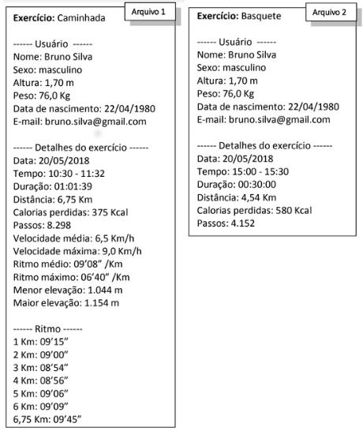

# SportViewer

Programa desktop para avaliação e acompanhamento de atividades físicas através da importação de arquivos que descrevem as atividades realizadas. Projeto desenvolvido para disciplina Teoria de Orientação a Objetos.

Os arquivos que são utilizados para importação precisam seguir um dos dois padrões pré-estabelecidos, para que a importação ocorra corretamente.

    

 Nos <a href="/arquivos_teste"> arquivos utilizados</a> para teste do programa se encontram alguns formatados de forma incorreta, propositalmente. Abaixo é possível visualizar como é realizada a importação.

    

Após a importação é possível verificar o desempenho dos usuários a partir dos gráficos que podem ser gerados, onde se pode selecionar o tipo de gráfico, de atividade ou as variáveis que serão analisádas.

    

É possível também gerar um relatório para cada usuário, a partir dele é possível obter as atividades físicas com maior número de passos dados, maior perda de calorías, entre outras variáveis.

    

Todos as análises geradas sobre as atividades físicas podem ser exportadas para um arquivo PDF. Esta função permite que o usuário do programa selecione o conteúdo que estará presente no PDF, ou seja, ele pode incluir, ou não,  o relatório e as informações pessoais e pode também selecionar os tipos de gráficos a serem exportados.

    

