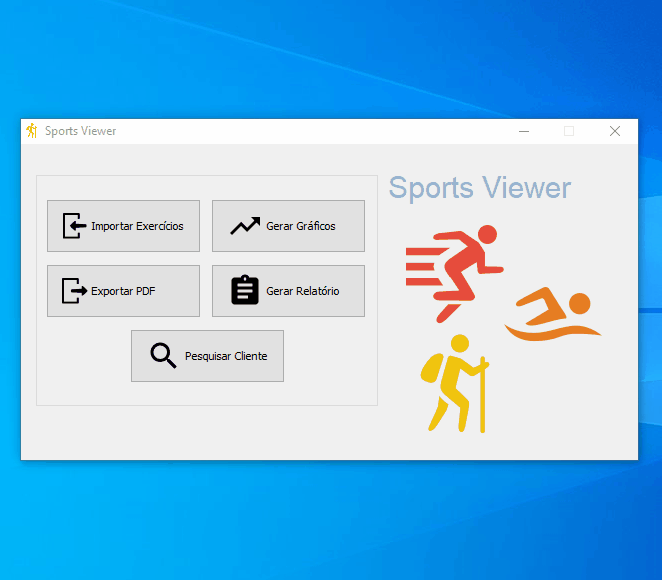
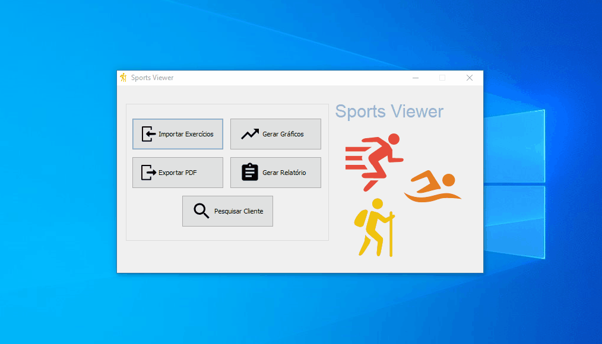
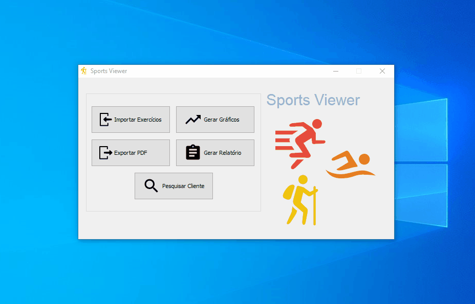

# SportViewer
Programa desktop para avaliação e acompanhamento de atividades físicas através da importação dos arquivos que descrevem as atividades realizadas. Projeto desenvolvido para disciplina Teoria de Orientação a Objetos.

O programa  permite a importação de arquivos de texto que irão descrever as atividades físicas de um cliente, sendo necessário que estes sigam um padrão pré-estabelecido para que a importação ocorra corretamento. Como os [arquivos utilizados para teste](/arquivos_teste)

    

Após a importação é possível verificar o desempenho dos clientes cadastrados a partir dos gráficos que podem ser gerados.

    

É possível também gerar um relatório para cada cliente, a partir dele é possível obter as atividades físicas com maior número de passos dados, maior perda de calorías e outras variáveis.

    

Todos as análises geradas sobre as atividades físicas podem exportadas para um arquivo PDF. Esta função permite que o usuário do programa selecione o conteúdo que estará presente no PDF, ou seja, ele pode incluir ou não o relatório e as informações pessoais e pode também selecionar os tipos de gráficos.

    

